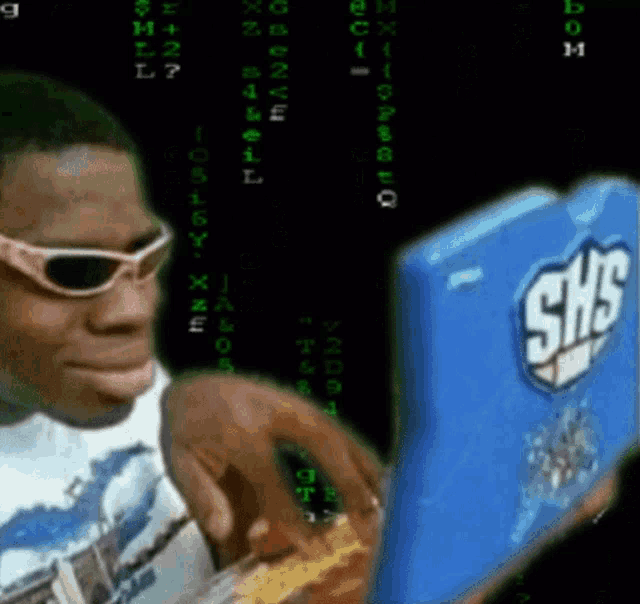

# Hi there, I'm Bernardo 😊👋

    
    
 I'm not this dude in the photo/gif 😅 

---

## 🛠️ 🧑‍💻 Technologies that I usually use in my daily life:

 

 

NOTE: Normally, I try to mix myself into theses Technologies so I can learn more and more how to code them. This way, I can connect to non-existent knowledge. I'm always improving myself to get better performances

---

## 📝 About me

    I'm a front-end developer with a passion for creating user-friendly and visually appealing interfaces. I'm a passionate and curious person who loves to learn and grow, every day trying to implement something and improve it

---

## ☎️ Contact Me

- **Email**: [ bernardomatta2011@gmail.com ]
- **Instagram**: [ https://www.instagram.com/bernardo_da_matta/ ]
- **Whatsapp**: [ https://wa.me/5542991560212 ]
- **Threads**: [ https://www.threads.net/@bernardo_da_matta ]

---